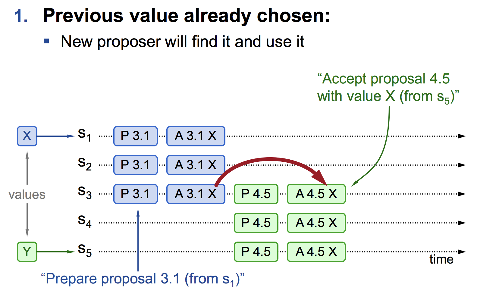
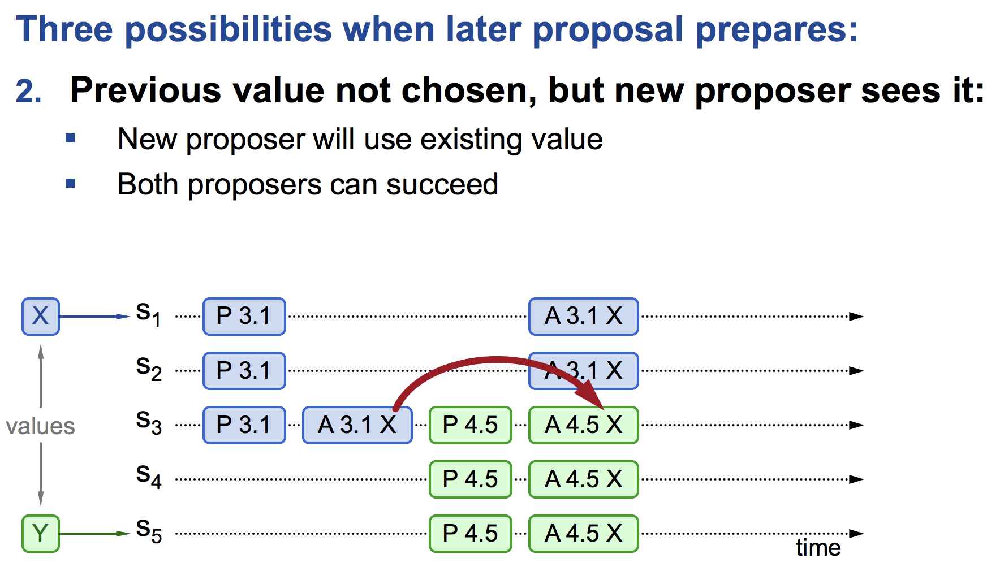
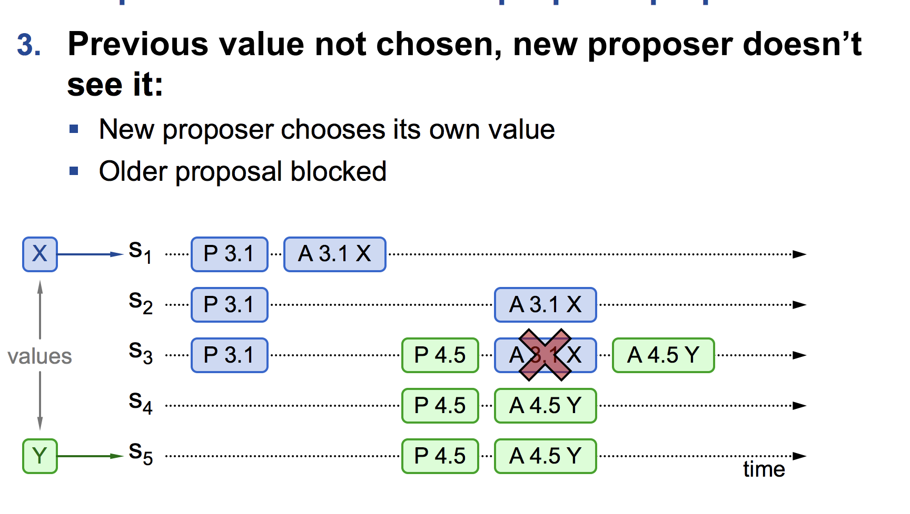
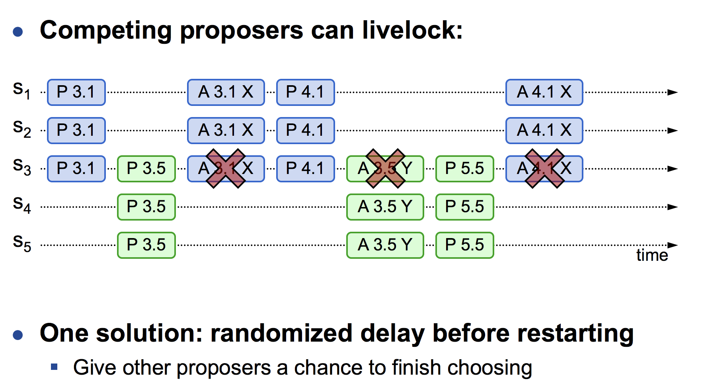

# Paxos算法

## basic paxos

一个实例，（确定一个值），写入需要两轮RPC

#### Proposal Number
Basic Paxos 定义一个 Proposal Number 标识唯一的提案。
定义为：<seq_id, server_id>，seq_id 可以是一个自增的 ID，同时为了避免崩溃重启，必须能在本地持久化存储，最后再拼接上 server_id，确保是分布式系统中唯一 ID

#### 两个原则、

**少数服从多数**
**后者认同前者**

#### 三种角色
* 提议者 (Proposer)：提出提案，发起paxos的进程
* 接受者 (Acceptor)：参与决策，接收、处理、存储消息
* 学习者 (Learner)：不参与决策

每个 节点/副本 能同时拥有多种角色，并且可以动态变化

#### 三个阶段
**1、准备阶段 (Prepare)**
   * 提议者选择一个提案编号 n（必须比之前所有提案编号大），向大多数（即至少一半以上）接受者发送 Prepare(n) 请求
   * 接受者收到 Prepare(n) 请求后，如果 n 大于其已响应的所有 Prepare 请求的编号，它会承诺不再接受编号小于 n 的提案，并回复一个 Promise(n, n′, v′) 响应，其中 n′ 是接受者之前接受过（Accept阶段）的最大编号的提案编号，v′ 是对应的提案值（如果没有则为空）
   * 提议者收到大多数接受者的 Promise 响应后，如果有任何一个接受者返回了一个非空的提案值 v′ 那么提议者将选择编号最大的提案值 v′作为新提案的值，否则提议者可以选择自己的提案值

**2、接受阶段 (Accept)**
  * 提议者选择提案值 v 后，向大多数接受者发送 Accept(n, v) 请求，其中 v 是上一步选择的提案值。
  * 接受者收到 Accept(n, v) 请求后，如果 n 大于或等于它之前承诺的编号，它会接受该提案并存储提案编号和值，随后回复 Accepted(n, v) 响应。 

<!-- 当提议者收到多数接受者的 Promise 响应后，它会发送一个 Accept(n, v) 请求，其中 v 是之前收到的 Promise 中编号最大的提案的值，如果没有，则是提议者自己选择的值。
接受者收到 Accept(n, v) 请求后，如果 n 不小于它已经承诺过的编号，它会接受该提案，并回复一个 Accepted(n, v) 响应。 -->

**3、学习阶段 (Learn)**
* 当一个提案 n 和值 v 被大多数接受者接受时，提议者会将提案值 v 发送给所有接受者和学习者（Learners），以确保该值被全体节点学习和记录

**承诺不会再接受提案 ID 小于或者等于 n 的 Prepare 请求**
**承诺不会再接受提案小于 n 的 Accept 请求**

先取得了多数派决策节点的 Promise 和 Accepted 应答情况

活锁情况

## multi paxso

约一轮RPC，确定一个值（第一次RPC做了合并）

## fast paxos

没冲突：一轮RPC确定一个值
有冲突：两轮RPC确定一个值

## 案例

#### 情景1：提议者在Prepare阶段挂了
1. 提议者发送Prepare请求
提议者选择一个提案编号 n，并向多数接受者（Acceptors）发送Prepare(n)请求。
2. 提议者挂了
提议者在收到多数Acceptors的Promise响应之前挂了。
3. 处理流程
提议者挂了：如果提议者挂了，没有其他提议者在此时继续进行该提案编号的Prepare过程。
等待新的提议者：集群中的其他节点可能会在某个时刻发起新的提案，选择比n更大的提案编号重新开始Prepare过程。
新提议者发起Prepare请求：新的提议者会选择比n更大的编号（如n'），向多数Acceptors发送Prepare(n')请求。
Acceptors响应：如果Acceptors之前承诺过n的提案，它们将拒绝任何编号小于n的Prepare请求，并响应新的提议者的Prepare(n')请求。
#### 情景2：提议者在Accept阶段挂了
1. 提议者发送Accept请求
提议者在收到多数 Acceptors 的Promise响应后，选择一个值 v，并向多数Acceptors发送Accept(n, v)请求。
2. 提议者挂了
提议者在收到多数Acceptors的Accepted响应之前挂了。
3. 处理流程
提议者挂了：如果提议者挂了，没有其他提议者在此时继续进行该提案编号的Accept过程。
等待新的提议者：集群中的其他节点可能会在某个时刻发起新的提案，选择比n更大的提案编号重新开始Prepare过程。
新提议者发起Prepare请求：新的提议者会选择比n更大的编号（如n'），向多数Acceptors发送Prepare(n')请求。
Acceptors响应：如果Acceptors之前接受了n的提案，它们将拒绝任何编号小于n的Accept请求，并响应新的提议者的Prepare(n')请求。
#### 情景3：接受者在Prepare阶段挂了
1. 提议者发送Prepare请求
提议者向多数Acceptors发送Prepare(n)请求。
2. 接受者挂了
某些Acceptors在处理Prepare(n)请求之前挂了。
3. 处理流程
多数原则：Paxos协议基于多数派决策原则，只要多数Acceptors活着，提议者依然能够获得足够的Promise响应。
提议者继续：提议者在收到多数Acceptors的Promise响应后，继续进行Accept阶段。
#### 情景4：接受者在Accept阶段挂了
1. 提议者发送Accept请求
提议者向多数Acceptors发送Accept(n, v)请求。
2. 接受者挂了
某些Acceptors在处理Accept(n, v)请求之前挂了。
3. 处理流程
多数原则：Paxos协议基于多数派决策原则，只要多数Acceptors活着，提议者依然能够获得足够的Accepted响应。
提议者继续：提议者在收到多数Acceptors的Accepted响应后，提案被认为已经被提交。
