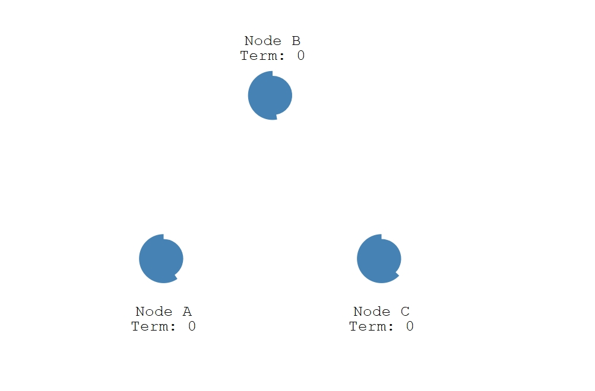
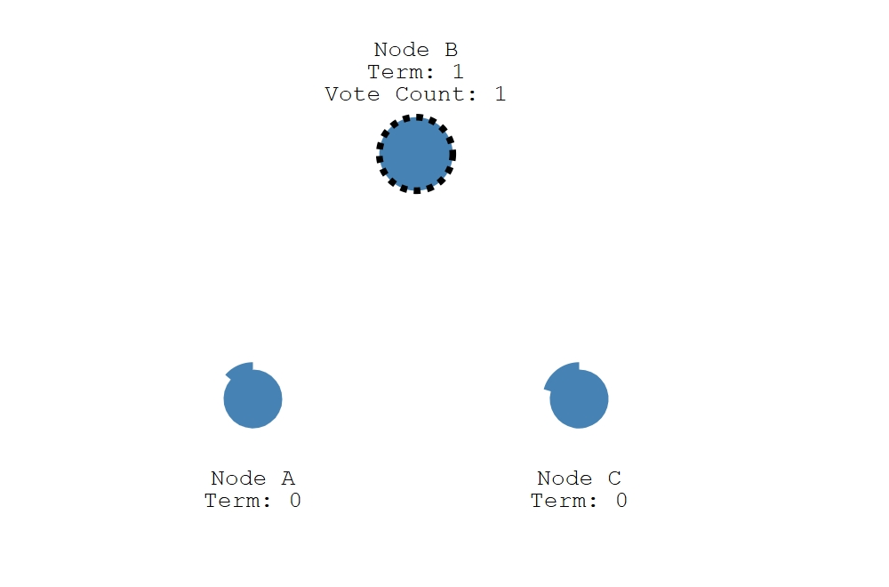
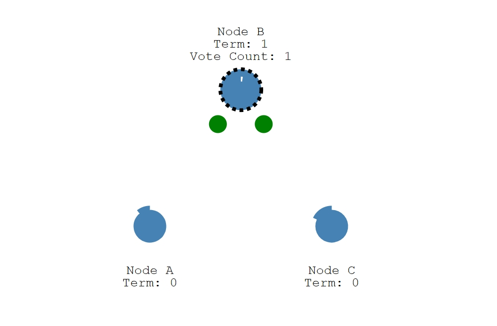
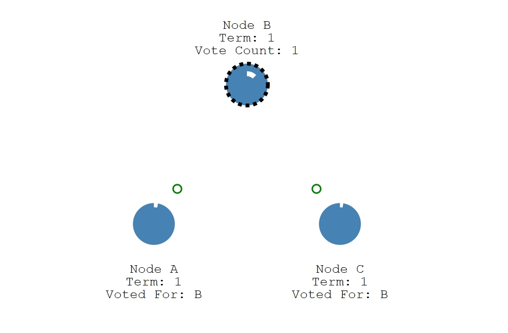
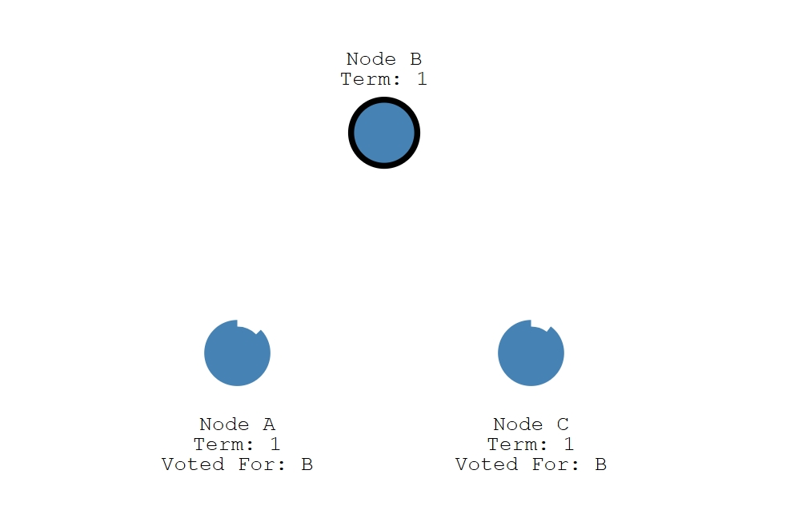
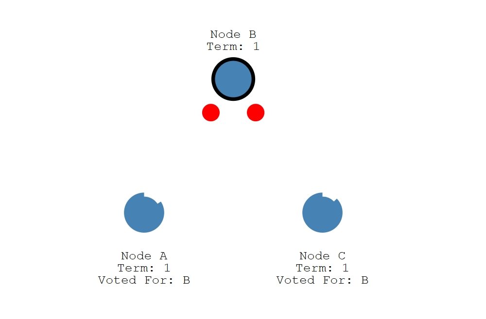
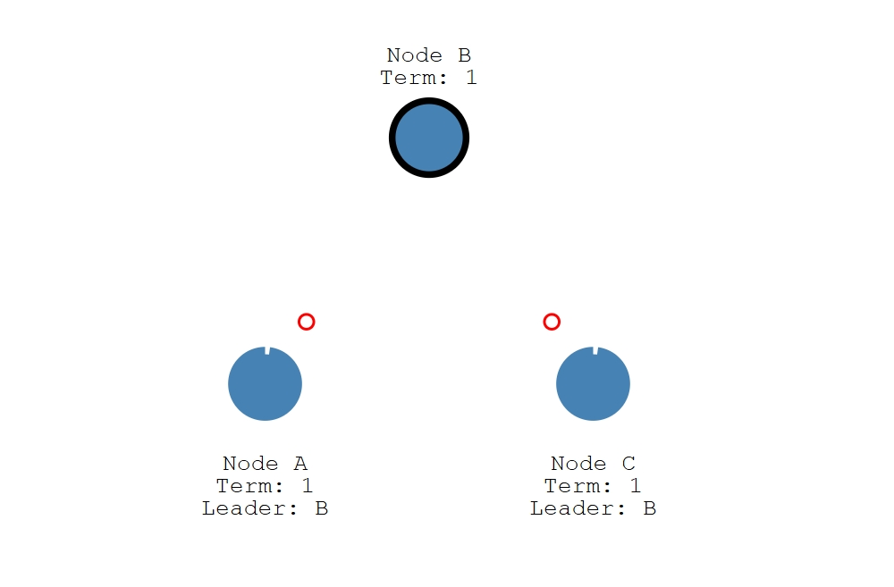
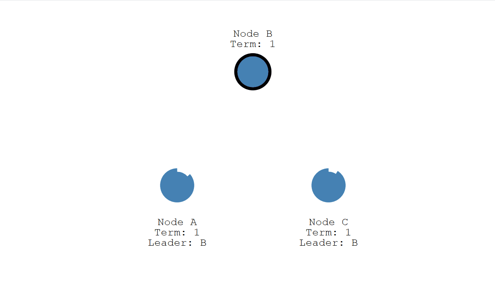
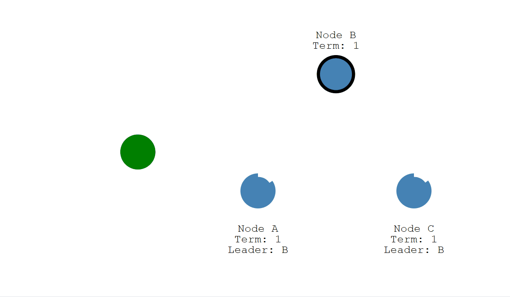

# Raft 算法


一个 Leader 节点， 多个 Follower 节点
只有 Leader 才能处理客户端的写请求，Follower 和 Candidate 都不能


* 三种角色
  * Follower: 追随者，默认状态，响应 Leader 的请求
  * Candidate: 候选人
  * Leader: 领导者
* 两个时间
  * 心跳间隔 (heartbeat interval) ：Leader 定期发送心跳的频率（比如 50ms）                
  * 选举超时 (election timeout): 追随者等待成为候选人的时间。即多久没收到心跳就发起选举（比如 150ms~300ms，随机值） 
* 一个任期（Term）


**1. 心跳间隔的设置要小于选举超时，不然会频繁发生选举**
**2. Raft 的 election timeout 每次都是随机生成的，且每轮都不同**
**3. 每轮投票中，只能投一票**


如果接收节点在本任期内尚未投票，那么它会投票给候选人……并且节点重置其选举超时。
一旦候选人获得多数票，就会成为领导者。

## Leader Election

#### 图解流程

初始状态：所有节点都为 Follower，等待选举超时


节点B先超时，成为候选人，任期+1，并且投自己一票


节点B向其他节点发送 RequestVote ，并且等待一轮新的 election timeout


其他节点接受到节点B的 RequestVote 之后，投票给节点B，并且等待新的一轮 election timeout


节点B接受到半数节点的投票后成为领导者


节点B成为 Leader 之后，定期发送心跳 AppendEntries(term=1, leaderId=B)


其他节点收到心跳之后重置选举超时计时器，并且响应 AppendEntries
其他节点如果之前成为候选人，将自己重新变为追随者



这个 trem=1 的任期会持续到有追随者停止接收心跳并成为候选人为止（因为候选者会拉投票，并把自己的任期+1）



#### 完整流程

1. 起点：集群中没有 Leader（比如刚启动或 Leader 挂了）
每个节点会设置一个 随机的 Election Timeout（选举超时），比如：
```
150ms ~ 300ms之间的随机值
```


2. 节点选举超时时间内没有收到心跳（AppendEntries）成为 Candidate
   * 增加 term
   * 给自己投票
   * 向其他节点发送 RequestVote
   * 等待投票结果
   * 等待期间如果收到新的 Leader 的心跳(AppendEntries) → 回退成 Follower

3. 其他节点收到 RequestVote 后的响应逻辑（如果满足就投票，否则拒绝）
   * 对方的任期是否更高
   * 自己是否已经投过票（每个 term 最多投一票）
   * 候选者日志是否“至少和自己一样新”


4. 选举成功 & 成为 Leader
   *  成为 Leader
   *  立即发送心跳（AppendEntries）告诉大家自己是 Leader

5. 选举失败的情况
   * 网络分区（分区节点不够多数）
   * 多个 Candidate 同时发起选举，出现投票冲突
   * 没拿到多数票
   * 这时 Candidate 会继续等待 Election Timeout，然后 重新发起选举（新一轮 term）

6. Leader 任期维护
   * 它会定期（如每隔 50ms）发送心跳给所有 Follower
   * 只要 Follower 能正常收到心跳，它们就不会变为 Candidate

7. 如果 Leader 崩溃或网络断了呢？
   * Follower 收不到心跳（AppendEntries）
   * ↓ 
   * 启动 Election Timeout 计时器超时后 
   * ↓
   * 进入下一轮选举


#### 一句话总结

**每个节点都会在没有 Leader 时，经过一个随机等待时间后尝试成为 Candidate，并拉票。拉票成功的那个节点成为 Leader，并用心跳维护统治地位。失败的 Candidate 会在下一轮选举超时后继续尝试，直到选出 Leader 为止。**


## Log Replication

raft 的日志复制 也是通过 心跳来传输的，即 AppendEntries 


#### 完整流程


示例：（写入 key1=value1）：

1. 客户端 → Leader：发送 PUT key1 value1 请求
2. Leader：将请求封装为一条日志，先写入本地日志列表（未提交）
3. Leader → Follower：发送 AppendEntries 同步这条日志
4. 多数 Follower 回复成功
5. Leader 更新 commitIndex，标记日志为“已提交”
6. Leader Apply 这条日志 → 写入状态机（例如内存数据库）
7. Leader 响应客户端：写入成功
8. Leader 下一次心跳 AppendEntries，告诉 Follower 提交日志


#### 图解流程


Leader 收到客户端请求后，把这个请求作为日志条目添加到本地日志中，并复制到大多数节点（Follower）上，最后提交。




