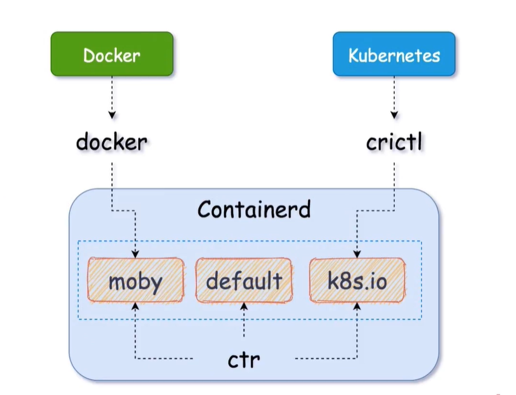

* OCI(Open Container Initiative)：开放容器标准规范
  * RUNC(原docker的libcontainer)
* CRI(Container Runtime Interface)：容器运行时
  * containerd(原docker一部分)
  * CRI-O


调用链
```
        CRI                         OCI
kubelet ---> docker ---> containerd ---> containerd-shim ---> runC
kubelet --->        containerd      ---> containerd-shim ---> runC
kubelet --->        cri-o           ---> containerd-shim ---> runC   
```


docker通过containerd来控制容器。
docker和containerd的镜像不共享。因为存储位置都不一样


containerd自己有个default命名空间，
使用docker会在containerd中创建一个moby命名空间
kubernetes会在containerd中创建一个k8s.io命名空间



Containerd通过ctl可以控制所有命名空间
docker只能操作moby命名空间
kubernetes通过crictl操作k8s.io命名空间

docker命令
```
docker [command]
```

Containerd自带ctr
```
ctr [global options] command [command options] [arguments...]

  GLOBAL OPTIONS:
    --help/-h                   帮助
    --version/-v                显示版本
    --debug                     开启debug日志
    --namespace value/-n value  指定命名空间，不指定默认使用default命名空间
  
  COMMANDS: 
    containers/c/container    容器管理
      create                    创建一个容器
      delete, del, rm           删除一个或者多个已存在的容器
      info                      查看一个容器的详细信息
      list, ls                  查看容器列表

    images/image/i            镜像管理
      export      
      import      
      list, ls   
      pull        
      push        
      remove, rm  
      tag         

    namespaces, namespace, ns   命名空间管理
      create, c         创建一个namespace
      list, ls          查看namespace
      remove, rm        删除一个或多个namespace
      label             给namespace打一个或者清除原有标签

    run                         启动一个容器


```

crictl - client for CRI
```
crictl

  COMMANDS:
    attach        Attach to a running container
    create        Create a new container
    exec          Run a command in a running container
    version       Display runtime version information
    images        List images
    inspect       Display the status of one or more containers
    inspecti      Return the status of one or more images
    inspectp      Display the status of one or more pods
    logs          Fetch the logs of a container
    port-forward  Forward local port to a pod
    ps            List containers
    pull          Pull an image from a registry
    runp          Run a new pod
    rm            Remove one or more containers
    rmi           Remove one or more images
    rmp           Remove one or more pods
    pods          List pods
    start         Start one or more created containers
    info          Display information of the container runtime
    stop          Stop one or more running containers
    stopp         Stop one or more running pods
    update        Update one or more running containers
    config        Get and set crictl options
    stats         List container(s) resource usage statistics
    completion    Output bash shell completion code
    help, h       Shows a list of commands or help for one command


```