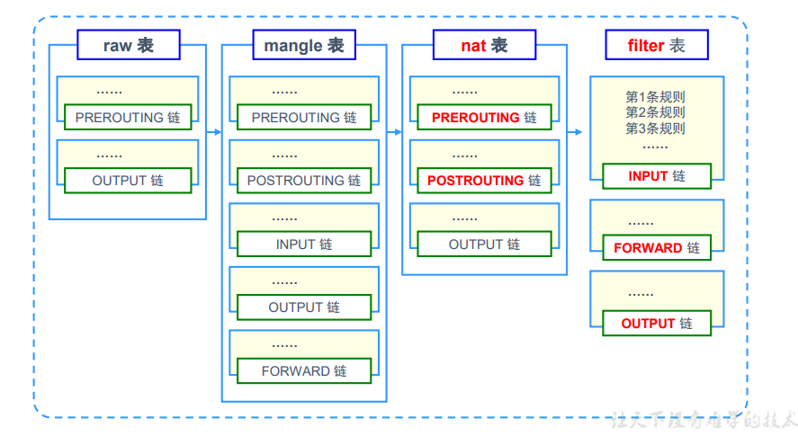
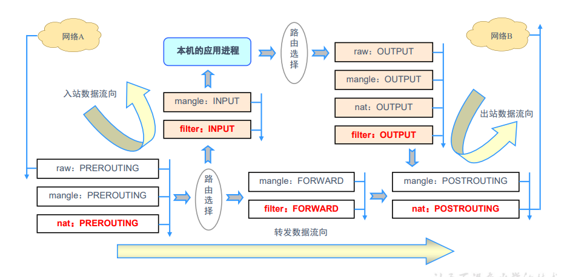

## 五链

* INPUT：处理入站数据包
* OUTPUT：处理出站数据包
* FORWARD：处理转发数据包
* PREROUTING：在进行路由选择前处理数据包
* POSTROUTING：在进行路由选择后处理数据包

## 四表

* raw表：确定是否对该数据包进行状态跟踪
* mangle表：为数据包设置标记
* nat表：修改数据包中的源，目标ip地址或者端口（SNAT，DNAT等技术）
* filter表：确定是否放行该数据包（过滤）

在centos7.x中，INPUT链还存在于nat表中



## 防火墙顺序


表顺序：
```
raw --> mangle --> nat --> filter
```

链顺序：
```
入站: PREROUTING --> INPUT
出站：OUTPUT --> POSTROUTING
转发：PREROUTING --> FORWARD --> POSTROUTING
回环：OUTPUT --> INPUT (自己访问自己)
```




按顺序依次检查，匹配即停止（LOG策略例外）
若找不到相匹配规则，则按该链的默认测量处理


例：一个入站请求的顺序
```
先看入站的链顺序：PREROUTING --> INPUT
再看链所在表，PREROUTING链在raw表，mangle表，nat表中。
INPUT链在 mangle表和filter表中，所以顺序如下

入站 --> raw表PREROUTING链 --> mangle表PREROUTING链 --> nat表PREROUTING链 
                                                            ↓
本机应用程序 <-- filter表INPUT链 <-- mangle表INPUT链 <--   路由选择               
```


## iptables 规则

```
iptables [-t 表名] 选项 [链名] [条件] [-j 控制类型]

不指定表名，默认指定filter表
不指定链名，默认指定所有链，即当前表中所有链
除非设置链的默认策略，否则必须指定匹配条件
选项，链名，控制类型使用大写字母，其余均为小写
```

```
选项
    -A  在链的末尾追加一条规则
    -I  在链的开头（或指定序号）插入一条规则
    -L  列出所有的规则条目
    -D  删除链内指定序号的一条规则
    -F  清空所有规则，（当前表）
    -P  指定链的默认规则，默认只能有2种类型（ACCEPT/DROP）
```

```
条件
    -L 的条件
        -n                  以数字形式显示地址，端口等信息    
        -v                  以更详细的方式查看规则信息
        --line-numbers      查看规则时，显示规则的序号
    -A/-I 的条件（能够多个条件一起使用）
        -p 协议名           指定协议名
        -s ip地址           指定源地址，可以是单个ip，或者一个网段
        -d ip地址           指定目的地址
        -i 网卡名           指定入站网卡，如 -i eth-0
        -o 网卡名           指定出站网卡
        
        --sport 端口        指定源端口
        --dport 端口        指定目的端口
        --icmp-type 数字    指定icmp-type级别（-p icmp --icmp-type）

        -m multiport --sport 源端口列表
        -m multiport --dport 目标端口列表
        -m iprange --src-range ip范围
        -m mac --mac-source MAC地址
        -m state --state 连接状态


```

```
控制类型：
    ACCEPT      允许通过
    DROP        直接丢弃，不给出任何回应（好比给女神发信息，女神看了不回）
    REJECT      拒绝连接，必要时会给出提示（好比给女神发信息，女神看了说你是个好人）
    LOG         记录日志信息，然后传给下一条规则继续匹配
    SNAT        修改数据包源地址
    DNAT        修改数据包目的地址
    REDIRECT    重定向

    -t nat 的控制类型
        SNAT                修改源地址
        DNAT                修改目标地址  
        --to-source         源ip地址
        --to-destination    目标ip地址
        MASQUERADE          地址伪装，适用于外网ip地址不固定，将SNAT规则改为MASQUERADE即可
```


例：在filter表的INPUT中添加一条规则，所有tcp入站放行
```sh
iptables -t filter -A INPUT -p tcp -j ACCEPT
```

例：在filter表中的INPUT链的第二个序列添加一条规则，对icmp放行
```sh
iptalbes -I INPUT 2 -p icmp -j ACCEPT
```

例：查看filter表的INPUT链的规则信息，显示规则序号
```sh
iptables -L INPUT --line-numbers 
```

例：修改filter表的INPUT的默认规则，改为DROP
```sh
iptables -P INPUT DROP
```

例：在filter表中的FORWARD链中末尾添加一条规则，对源ip是192.168.2.0/24网段内的ip，并且访问端口是53的udp协议放行
```sh
iptables -A FORWARD -s 192.168.2.0/24 -p udp -dport 53 -j ACCEPT
```

例：在filter表的INPUT链最开始插入一条规则，对目标端口是80-82，和85的端口的tcp请求放行
```sh
iptables -I INPUT -p tcp -m multiport --dport 80-82,85 -j ACCEPT
```

例：在nat表中的POSTROUTING链中添加一条规则，源ip为192.168.1.0/24的且出网网卡为eth0时候 修改源ip地址，改为60.176.145.96
```sh
iptables -t nat -A POSTROUTING -s 192.168.0.1/24 -o eth0 -j SNAT --to-source 60.176.145.96

地址伪装，自动获取外网ip
iptables -t nat -A POSTROUTING -s 192.168.0.1/24 -o eth0 -j MASQUERADE
```


例：在nat表的PREROUTING链中添加一条规则，入站网卡eth0 且目的ip为60.176.145.96，tcp协议，端口为80的请求修改目的地址为192.168.1.6
```sh
iptables -t nat -A PREROUTING -i eth0 -d 60.176.145.96 -p tcp --dport 80 -j DNAT --to-destination 192.168.1.6
```


添加规则时，访问量多的放前面，因为匹配到才终止，从上往下匹配规则，


## 配置文件

linux一切皆文件，iptables通过命令行的操作，在重启linux或者重启network和iptables本身都会失效


配置文件
```sh
/etc/sysconfig/iptables
```

常用命令
```sh
iptables-save
iptables-restore
```


将当前防火墙规则持久化，即写入文件
```sh
service iptables save
或
iptables-save > /etc/sysconfig/iptables
```

例：将当前防火墙导入文件，为另一台机器使用
```sh
iptables-save > 1.iptables
    ↓
另一台linux
    ↓
iptables-restore < 1.iptables
```

例：清空防火墙规则，先清空当前防火墙，再写入文件
```sh
iptables -F
iptables-save > /etc/sysconfig/iptables
```


## centos7.x 使用 iptables 替换 firewalld

因为centos 7 默认使用的是 firewalld ，虽然内核态都是 netfilter ，但是应用态不同

1. 卸载原来的防火墙工具 firewalld
```sh
systemctl stop firewalld
systemctl disable firewalld
yum remove firewalld
```
2. 安装iptables工具
```sh
yum install -y iptables-services
systemctl enable iptables --now
```


