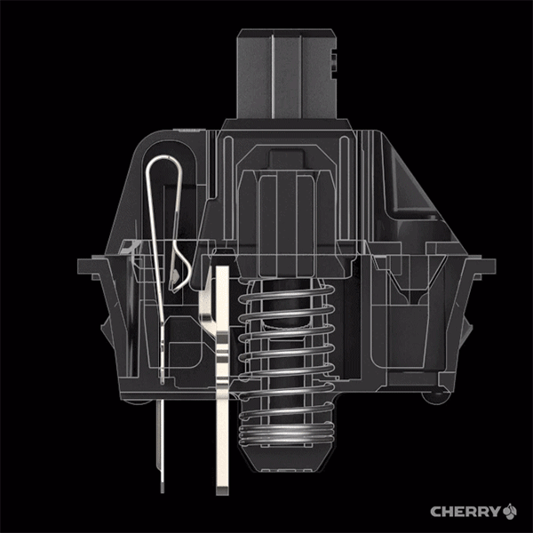
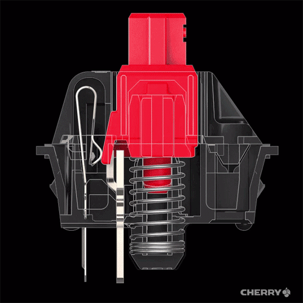
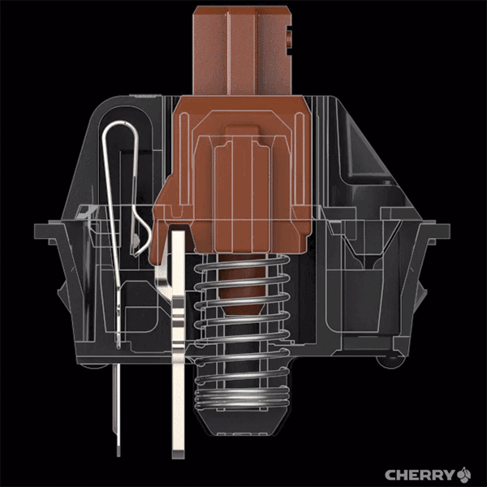
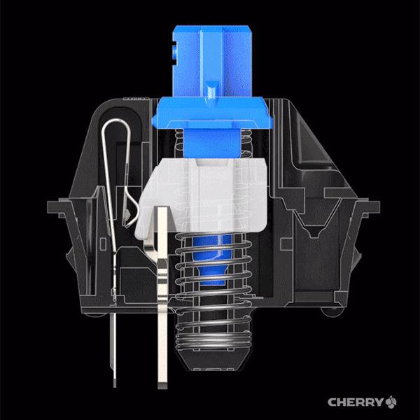

## 薄膜键盘

## 机械键盘

* 黑轴
* 红轴
* 茶轴
* 青轴


### 轴体
不同轴主要在于轴体不同，结构上的区别会影响不同轴体产生不同的声音，压力及手感。

轴体又分为
* 线性轴体：红轴，黑轴
* 段落轴体：青轴，茶轴

轴体从上往下如下
```
        轴体上盖
    /   开关帽
轴体    触体金属片
    \   弹簧
        轴体底座
```

### 压力

压力分为
* 初始压力
* 触发压力
* 段落压力

```
初始压力

黑轴 = 茶轴 = 红轴 > 青轴
```

```
触发压力

黑轴 > 青轴 > 茶轴 > 红轴
```

```
段落压力：只存在于青轴和茶轴

青轴 > 茶轴
```

### 黑轴

### 红轴

### 茶轴

### 青轴


